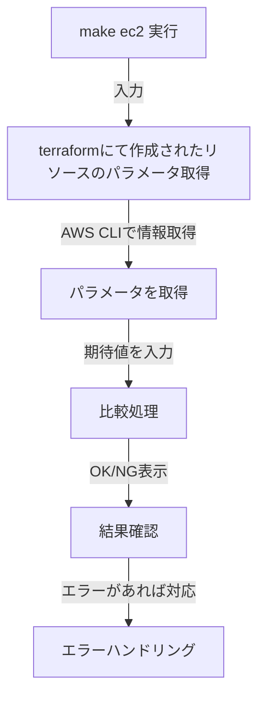

# EC2 パラメータ単体テストスクリプト使用手順

## 1. 概要
本ドラフトは、AWS上のEC2のパラメータテストを自動化する仕組みについて記載する。

## 2. 目的
- AWSリソース（EC2）の設定が期待通りであることを手動で確認する。
- Terraformにおける、作成リソースのプランとAWS CLIのdescribeコマンドにて出力されるパラメータ、設定の正当性を検証する。

## 3. 前提条件
‐ `Terraform`が使用できる環境下であること
- `aws` CLI がインストールされ、適切な権限で設定されていること (`aws configure`)
- `jq` コマンドが利用可能であること（例：`sudo yum install -y jq`）
- AWS環境にテスト対象のリソースが存在すること

- テスト対象のEC2インスタンスに対して `aws ec2 describe-instances` コマンドを実行できる適切なIAM権限 (`ec2:DescribeInstances`) を持っていること

## 4. システム構成

### 4.1 遷移図
以下の図は、EC2のパラメータテストの流れを表したものである。



## 5. テスト対象リソースとパラメータ

テスト対象となるEC2インスタンスのパラメータは以下の通りです。`describe-instances` コマンドを使用して取得する。
<br>EC2だけでなく、他のリソースでもテストできるよう　工事中です。

### 5.1 EC2
<br>パラメータ自体も増やす想定です。

| パラメータ | 説明 |
|-----------|------|
| instance_type | インスタンスタイプ |
| ami | AMI ID |
| private_ip | プライベートIPアドレス |
| subnet_id | サブネットID |
| vpc_security_group_ids | セキュリティグループID（複数可） |
| key_name | SSHキー名 |
| iam_instance_profile | IAMインスタンスプロファイル |

エラーが発生した場合、IAM権限不足や対象インスタンスが存在しない可能性があり。

## 6. 実行コマンド一覧

| コマンド | 説明 |
|---------|------|
| `make ec2` | EC2のパラメータテストを実行 |

## 7. 使用するAWS CLIコマンド

本テストでは、AWS CLI の `describe-instances` コマンドを使用し、EC2の設定値を取得して期待値と比較。

```sh
aws ec2 describe-instances --instance-ids <INSTANCE_ID> --query 'Reservations[].Instances[0]'
```

### 7.1 実行結果の例

以下は `describe-instances` コマンドの出力例です。

```json
{
  "Reservations": [
    {
      "Instances": [
        {
          "InstanceId": "i-0123456789abcdef0",
          "InstanceType": "t3.micro",
          "ImageId": "ami-12345678",
          "PrivateIpAddress": "192.168.1.100",
          "SubnetId": "subnet-1234abcd",
          "SecurityGroups": [{"GroupId": "sg-5678efgh"}],
          "KeyName": "my-key",
          "IamInstanceProfile": {"Arn": "arn:aws:iam::123456789012:instance-profile/MyInstanceProfile"}
        }
      ]
    }
  ]
}
```

## 8. 必要なIAM権限

このテストを実行するには、以下のIAM権限が必要です。

```json
{
  "Version": "2012-10-17",
  "Statement": [
    {
      "Effect": "Allow",
      "Action": "ec2:DescribeInstances",
      "Resource": "*"
    }
  ]
}
```

エラーハンドリングとして、権限不足の際のエラーメッセージ例を以下に示す。

```sh
An error occurred (UnauthorizedOperation) when calling the DescribeInstances operation: You are not authorized to perform this operation.
```

この場合、IAMポリシーを確認し、必要な権限が付与されているかを確認してください。

## 9. 成果物

- 本テストの結果は、標準出力で確認すること。
- `OK` / `NG` の結果を分かりやすく色分けして表示する。

## 10. エラーハンドリングと備忘録

### 10.1 エラーハンドリング

- `describe-instances` コマンドが失敗した場合の対応策
- IAM権限不足の場合、ポリシーを確認し適用する。
- インスタンスが見つからない場合、入力したインスタンスIDが正しいか確認する。

### 10.2 FAQ

#### . `describe-instances` の実行結果が異なるのはなぜ？

A. 取得するリージョンが違っている可能性がある。 `aws configure` の設定を確認してください。

#### Q. IAMロールを使用する場合の注意点は？

A. AWS CLI で `--profile` オプションを適用し、適切な権限を持つロールで実行してください。
```
